# Taller computacional: caos, conjunto de Mandelbrot y universalidad de Feigenbaum

Curso de Sistemas Complejos
## Requisitos

```bash
pip install numpy scipy matplotlib
python taller_caos.py
```

El script genera todas las figuras en `figs/` y un resumen numérico en `resultados.json`.

## Contenido

- [Punto 1 — Exploración de órbitas complejas](#punto-1--exploración-de-órbitas-complejas)
- [Punto 2 — Construcción del conjunto de Mandelbrot](#punto-2--construcción-del-conjunto-de-mandelbrot)
- [Punto 3 — Ampliación de una región fractal](#punto-3--ampliación-de-una-región-fractal)
- [Punto 4 — Diagrama de bifurcación del mapa logístico](#punto-4--diagrama-de-bifurcación-del-mapa-logístico)
- [Punto 5 — Estimación de la constante universal](#punto-5--estimación-de-la-constante-universal)
- [Reto — Conexión entre Mandelbrot y las bifurcaciones](#reto--conexión-entre-mandelbrot-y-las-bifurcaciones)
- [Pregunta integradora](#pregunta-integradora)

---

## Punto 1 — Exploración de órbitas complejas

Función `orbita(c, nmax=100)`: itera $z_{n+1} = z_n^2 + c$ desde $z_0 = 0$ y devuelve si escapó, la iteración de escape, los primeros valores y el máximo módulo.

```python
def orbita(c, nmax=100, radio=2.0, nprim=8):
    z = 0j; orb = [z]; max_mod = 0.0
    for n in range(1, nmax + 1):
        z = z*z + c; orb.append(z)
        max_mod = max(max_mod, abs(z))
        if abs(z) > radio:
            return dict(escapo=True, n_escape=n, primeros=orb[:nprim], max_mod=max_mod)
    return dict(escapo=False, n_escape=None, primeros=orb[:nprim], max_mod=max_mod)
```

| c | ¿Escapa? | Iteración de escape | Máximo \|z_n\| | Comportamiento observado |
|---|---|---|---|---|
| 0 | No | — | 0 | Punto fijo: z_n = 0 para todo n (periodo 1). |
| −1 | No | — | 1 | Ciclo de periodo 2: 0, −1, 0, −1, … |
| 1 | Sí | 3 | 5 | Divergente: 0, 1, 2, 5, 26, … Supera 2 en n = 3. |
| −0.75 + 0.1i | Sí | 33 | 2.704 | Escape lento en espiral; c está pegado a la cúspide de la cardioide. |
| −0.1 + 0.65i | Sí | 75 | 3.002 | Escape muy lento (n=75); c está justo fuera de la frontera. |

Con 100 000 iteraciones se confirma la misma clasificación: c=0 y c=−1 son realmente acotados; los demás divergen.

**a) Diferencia entre órbita acotada, periódica y divergente.**
Una órbita acotada cumple $|z_n| \le M$ para todo $n$. Una periódica es un caso particular de acotada, que se repite con periodo $p$ ($c=0 \to p=1$, $c=-1 \to p=2$). Una divergente tiene $|z_n|\to\infty$ (caso $c=1$). También existen órbitas acotadas no periódicas (caóticas), típicas de la frontera del conjunto.

**b) ¿Por qué |z_n| > 2 permite detener la iteración?**
Si $|z_n|>2$ y $|c|\le 2$: $|z_{n+1}| \ge |z_n|^2 - |c| > |z_n|^2 - 2$. Como $z^2-z-2=(z-2)(z+1)>0$ para $z>2$, se tiene $|z_{n+1}|>|z_n|$, y el margen de crecimiento también aumenta, así que la sucesión diverge sin retorno. Por eso 2 es un radio de escape seguro.

**c) ¿Se puede asegurar pertenencia con un número finito de iteraciones?**
No. Solo se puede certificar el *escape*. "No escapó en N pasos" no prueba pertenencia: $c=-0.1+0.65i$ escapa en $n=75$, así que con $N_{max}=50$ se habría clasificado mal como interior. Cerca de la frontera el escape puede tardar miles de pasos, y el punto flotante añade error que el caos amplifica. Probar pertenencia exige argumentos adicionales (p. ej. hallar un ciclo atractor).

---

## Punto 2 — Construcción del conjunto de Mandelbrot

Región $-2 \le \mathrm{Re}(c) \le 1$, $-1.5 \le \mathrm{Im}(c) \le 1.5$, malla 800×800, radio de escape 2, cálculo vectorizado (solo se actualizan los puntos aún vivos).

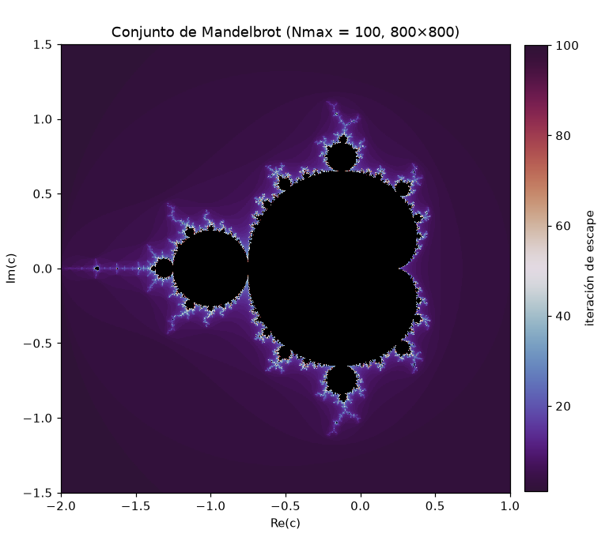

*Figura 1. N_max = 100 (versión base pedida).*

| N_max = 50 | N_max = 200 |
|---|---|
| 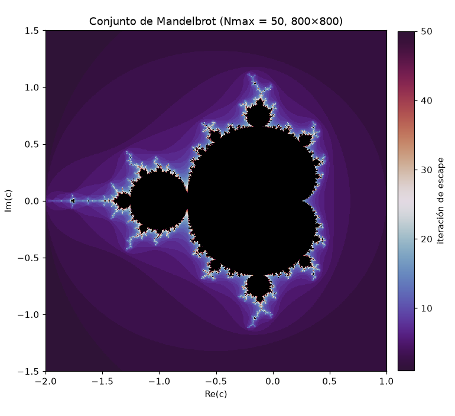 | 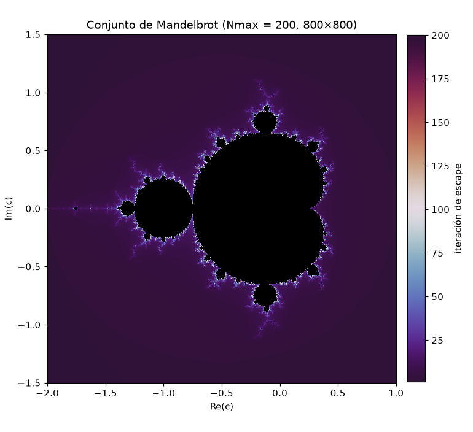 |

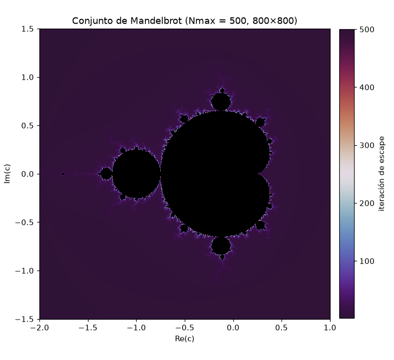

*Figura 2. Comparación N_max = 50, 200, 500.*

| N_max | Tiempo (s) | Píxeles sin escapar | Área estimada |
|---|---|---|---|
| 50 | 0.17 | 17.60 % | 1.5842 |
| 100 | 0.31 | 17.13 % | 1.5421 |
| 200 | 0.55 | 16.92 % | 1.5226 |
| 500 | 1.33 | 16.79 % | 1.5112 |

**a) ¿Qué cambia al aumentar N_max?**
La región negra se reduce (de 17.6% a 16.8% de píxeles, área estimada de 1.584 a 1.511): puntos antes mal clasificados como interiores se reconocen como divergentes. La frontera se afina y el tiempo crece casi linealmente con N_max.

**b) ¿Dónde hay más detalle?**
En la frontera: la cúspide en $c=-0.75$, el valle de los caballitos de mar ($\mathrm{Re}\approx-0.75$, $\mathrm{Im}\approx0.1$), las espirales de la cardioide, los bulbos de periodo 3 y 4, y la antena hacia $c=-2$.

**c) ¿Por qué la frontera es más compleja que el interior?**
En el interior las órbitas caen rápido a un ciclo atractor: todo se ve uniforme. En la frontera, puntos vecinos tienen tiempos de escape muy distintos — sensibilidad extrema a c — lo que genera estructura a todas las escalas (dimensión de Hausdorff 2).

**d) ¿Es exactamente el conjunto matemático?**
No. Es una aproximación: (1) se evalúa una malla finita, no todo el plano; (2) con N_max finito el negro sobreestima el conjunto (el área baja hacia el valor real ≈1.5066 al subir N_max); (3) el punto flotante tiene precisión limitada. El conjunto exacto es el límite N_max→∞ con resolución infinita.

---

## Punto 3 — Ampliación de una región fractal

Se partió de la primera ventana sugerida y se profundizó hacia el valle de los caballitos de mar, subiendo N_max con la profundidad.

| Ampliación | Límites (Re ; Im) | Resolución | N_max | Tiempo (s) | Factor de zoom |
|---|---|---|---|---|---|
| 1 | [-0.8, -0.7] ; [0.05, 0.15] | 800×800 | 300 | 1.56 | 30× |
| 2 | [-0.755, -0.735] ; [0.103, 0.123] | 800×800 | 600 | 2.76 | 150× |
| 3 | [-0.7465, -0.7445] ; [0.1115, 0.1135] | 800×800 | 1200 | 3.33 | 1500× |

| Ampliación 1 (30×) | Ampliación 2 (150×) |
|---|---|
| 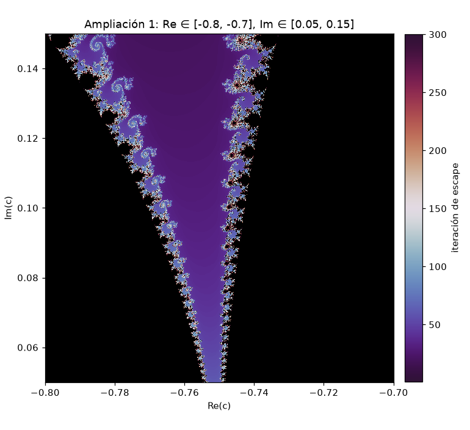 | 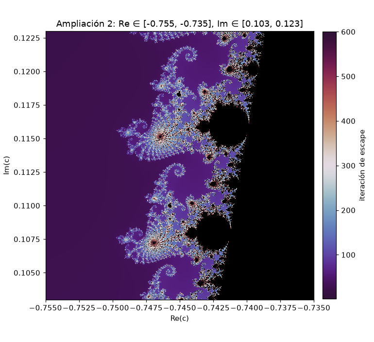 |

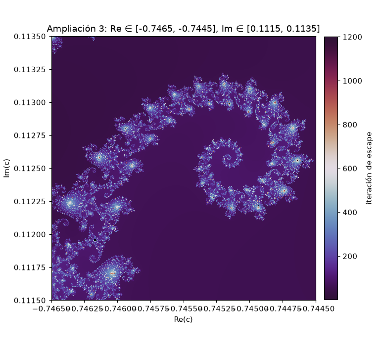

*Ampliación 3 (1500×): espiral con mini-Mandelbrots en cada brazo.*

Costo computacional (ventana 1, distintas resoluciones y N_max):

| Resolución \ N_max | 100 | 300 | 1000 |
|---|---|---|---|
| 200×200 | 0.03 s | 0.08 s | 0.25 s |
| 400×400 | 0.14 s | 0.39 s | 1.20 s |
| 800×800 | 0.54 s | 1.54 s | 4.82 s |

**a) ¿Se observan estructuras semejantes a diferentes escalas?**
Sí: espirales, caballitos de mar y, en el zoom final, pequeñas copias del conjunto completo (cardioide, bulbos, antena).

**b) ¿Copias exactas o aproximadas?**
Aproximadas. El conjunto es "casi autosemejante": cada mini-Mandelbrot está deformado según su posición y escala, a diferencia de fractales exactamente autosemejantes (p. ej. el triángulo de Sierpiński).

**c) Relación entre resolución, N_max y tiempo.**
El costo ≈ (número de píxeles) × N_max: duplicar la resolución multiplica el tiempo ×4 aprox. (0.25 s → 1.20 s → 4.96 s con N_max=1000); multiplicar N_max ×10 lo multiplica ×9 aprox. Al ampliar, N_max debe subir para no perder detalle, encareciendo cada zoom.

**d) ¿Por qué es un ejemplo de complejidad emergente?**
Una regla local mínima ($z\mapsto z^2+c$) genera, sin diseño global, infinitos niveles de detalle y copias parciales de sí misma. Esa organización emerge de la iteración y la no linealidad, no está codificada explícitamente en la fórmula.

---

## Punto 4 — Diagrama de bifurcación del mapa logístico

Config: 6000 valores de $r\in[2.5,4]$, $x_0=0.5$, 1500 iteraciones, se descartan las primeras 1000, se grafican las últimas 500. Cálculo vectorizado: 0.018 s.

```python
def bif(rmin, rmax, nr=6000, niter=1500, descartar=1000):
    r = np.linspace(rmin, rmax, nr); x = 0.5*np.ones(nr)
    X = np.empty((niter-descartar, nr))
    for i in range(niter):
        x = r*x*(1-x)
        if i >= descartar: X[i-descartar] = x
    return r, X
```

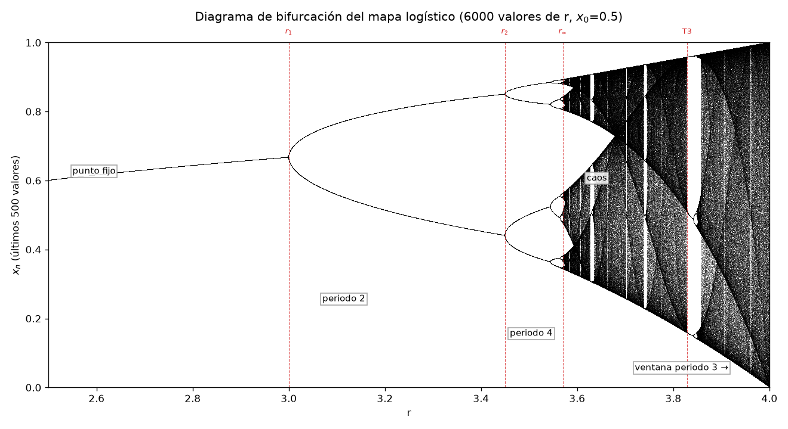

*Figura 3. Líneas rojas: r₁=3, r₂, r_∞ y la ventana de periodo 3.*

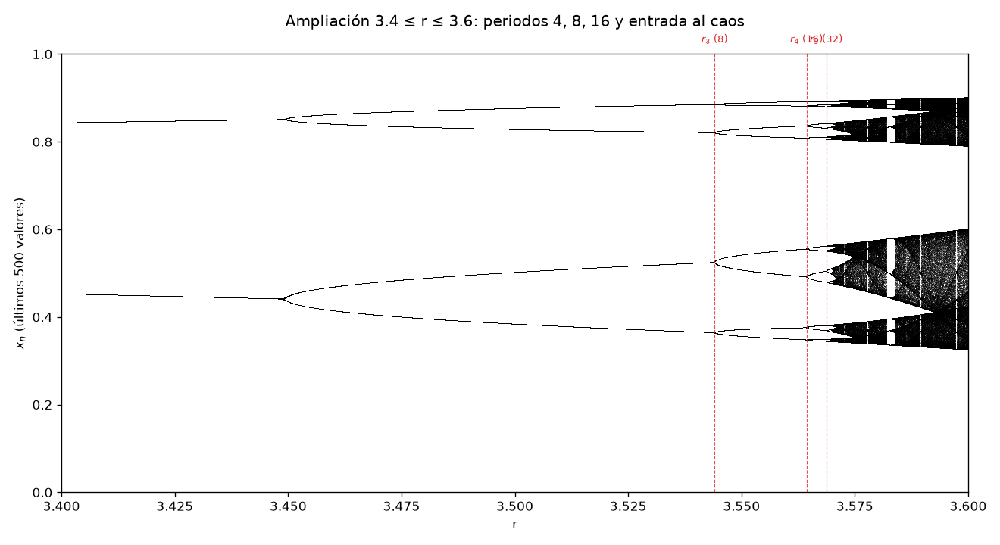

*Figura 4. Ampliación 3.4 ≤ r ≤ 3.6.*

### Regímenes identificados

| Régimen | Intervalo aproximado de r |
|---|---|
| Punto fijo (x* = 1 − 1/r) | 2.5 ≤ r < 3 |
| Ciclo de periodo 2 | 3 < r < 3.4495 |
| Ciclo de periodo 4 | 3.4495 < r < 3.5441 |
| Ciclo de periodo 8 | 3.5441 < r < 3.5644 |
| Ciclo de periodo 16 | 3.5644 < r < 3.5688 |
| Inicio del caos (r_∞) | ≈ 3.56995 |
| Ventana de periodo 3 | ≈ 3.8284 a ≈ 3.8415 |
| Otras ventanas visibles | periodo 6 en r ≈ 3.63, periodo 5 en r ≈ 3.74 |

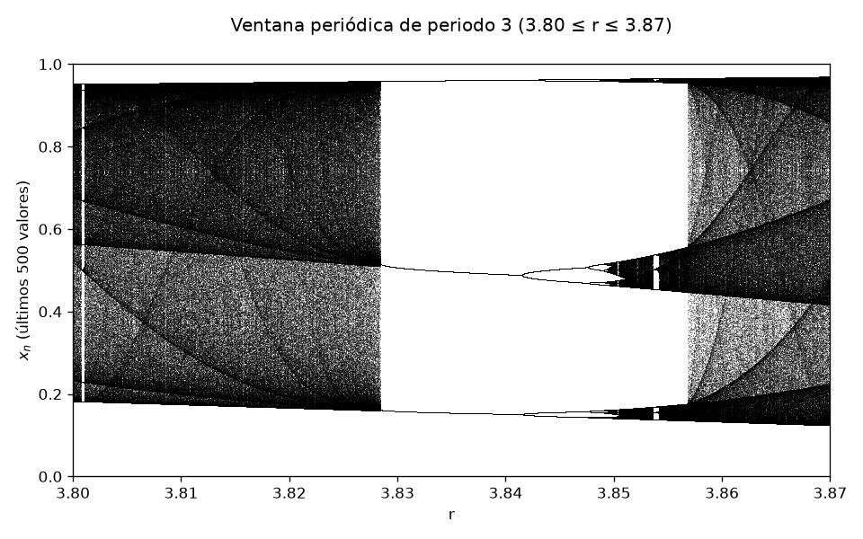

*Figura 5. Ventana de periodo 3 con duplicaciones internas (3.80 ≤ r ≤ 3.87).*

**¿Por qué descartar las primeras iteraciones?**
La órbita desde $x_0=0.5$ aún no está sobre el atractor: durante el transitorio los valores se acercan al punto fijo, ciclo o región caótica. Graficarlos ensuciaría el diagrama con puntos espurios. Interesa el comportamiento asintótico.

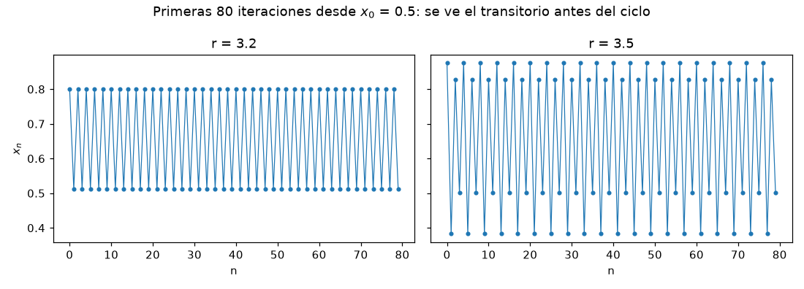

*Figura 6. Primeras 80 iteraciones (r=3.2 y r=3.5): el ciclo solo se define tras el transitorio, que se alarga cerca de las bifurcaciones.*

---

## Punto 5 — Estimación de la constante universal

### Procedimiento (tres niveles de refinamiento)

1. **Lectura del diagrama:** primer r con al menos $2^n$ valores distintos entre los 500 puntos graficados.
2. **Búsqueda progresiva:** para cada n, predicado $|f^p(x)-x|>\text{tol}$ ($p=2^{n-1}$) tras T iteraciones de transitorio, evaluado en 400 valores de r con 4 niveles de refinamiento sucesivo.
3. **Condición de bifurcación:** en $r_n$ el ciclo de periodo $p=2^{n-1}$ tiene multiplicador $(f^p)'(x)=-1$; se resuelve por Newton (`fsolve`) el sistema $f^p(x)=x,\ (f^p)'(x)=-1$, partiendo de los parámetros superestables (ciclo que contiene $x=\tfrac12$). Para $n=1$: $f'(x^*)=2-r=-1 \Rightarrow r_1=3$ (exacto).

### Resultados (método 3, el más preciso)

| n | Periodo | r_n estimado | r_n − r_(n−1) | δ_n | E_n |
|---|---|---|---|---|---|
| 1 | 2 | 3.000000000 | — | — | — |
| 2 | 4 | 3.449489743 | 4.495e-01 | 4.751446 | 1.7614 % |
| 3 | 8 | 3.544090360 | 9.460e-02 | 4.656251 | 0.2774 % |
| 4 | 16 | 3.564407266 | 2.032e-02 | 4.668242 | 0.0205 % |
| 5 | 32 | 3.568759420 | 4.352e-03 | 4.668739 | 0.0099 % |
| 6 | 64 | 3.569691610 | 9.322e-04 | 4.669132 | 0.0015 % |
| 7 | 128 | 3.569891259 | 1.996e-04 | 4.669183 | 0.0004 % |
| 8 | 256 | 3.569934018 | 4.276e-05 | 4.669198 | 0.0001 % |
| 9 | 512 | 3.569943176 | 9.158e-06 | — | — |

Calculado hasta $n=9$ (periodo 512) para dar δ_n hasta $n=8$. Punto de acumulación extrapolado: $r_\infty \approx 3.5699457$.

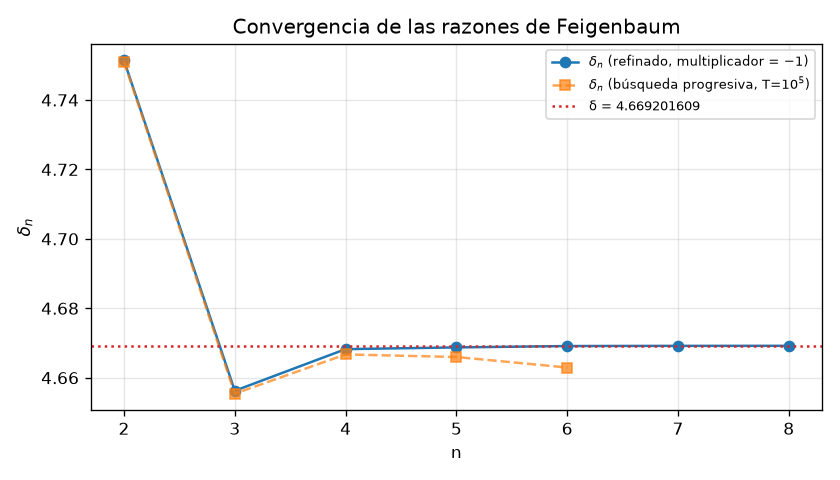

*Figura 7. δ_n vs. n, frente al valor teórico 4.669201609.*

### Comparación entre métodos

Lectura directa del diagrama (paso de r ≈ 2.5·10⁻⁴):

| n | Periodo | r_n leído del diagrama | r_n refinado |
|---|---|---|---|
| 1 | 2 | 2.9958 | 3.0000 |
| 2 | 4 | 2.9973 | 3.4495 |
| 3 | 8 | 3.5439 | 3.5441 |
| 4 | 16 | 3.5657 | 3.5644 |
| 5 | 32 | 3.5697 | 3.5688 |
| 6 | 64 | 3.5702 | 3.5697 |

Error absoluto de la búsqueda progresiva según el transitorio T:

| n | Periodo | \|error\| T=10³ | \|error\| T=10⁴ | \|error\| T=10⁵ |
|---|---|---|---|---|
| 1 | 2 | 1.1e-02 | 9.9e-04 | 8.7e-05 |
| 2 | 4 | 4.2e-03 | 3.8e-04 | 3.3e-05 |
| 3 | 8 | 1.7e-03 | 1.5e-04 | 1.3e-05 |
| 4 | 16 | 6.4e-04 | 6.0e-05 | 5.1e-06 |
| 5 | 32 | 2.2e-04 | 2.3e-05 | 2.0e-06 |
| 6 | 64 | 6.7e-05 | 7.9e-06 | 7.6e-07 |
| 7 | 128 | 2.2e-05 | 2.4e-06 | 2.3e-07 |

Razones δ_n obtenidas con cada método:

| n | δ_n (T=10³) | δ_n (T=10⁴) | δ_n (T=10⁵) | δ_n refinado |
|---|---|---|---|---|
| 2 | 4.6990 | 4.7467 | 4.7510 | 4.7514 |
| 3 | 4.5534 | 4.6466 | 4.6554 | 4.6563 |
| 4 | 4.4652 | 4.6504 | 4.6667 | 4.6682 |
| 5 | 4.4117 | 4.6305 | 4.6660 | 4.6687 |
| 6 | 4.4314 | 4.6195 | 4.6629 | 4.6691 |

**a) ¿Convergen las estimaciones?**
Sí. Con los valores refinados, $E_n$ cae de 1.76% (n=2) a 0.28%, 0.021%, 0.010%, 0.0015%, hasta 0.00008% en n=8.

**b) ¿Por qué las primeras razones están alejadas del valor teórico?**
La constante es un límite ($n\to\infty$). Para n pequeño, $r_n$ es sensible a correcciones de orden superior: $\delta_2=4.7514$ y $\delta_3=4.6563$ quedan a ambos lados de 4.6692 porque aún no domina el punto fijo del operador de renormalización. Las correcciones decaen como $\delta^{-n}$.

**c) Dificultades numéricas con periodos altos.**
(1) *Lentitud crítica:* cerca de $r_n$ el multiplicador es casi −1 y el transitorio decae lentamente. (2) *Separación de ramas:* nacen a distancia $\sim\sqrt{r-r_n}$, pudiendo caer bajo la tolerancia o resolución de píxeles. (3) *Espaciado de r:* $r_n-r_{n-1}$ decrece ≈4.67× por paso; con paso 2.5·10⁻⁴, $r_6-r_5=9.3\times10^{-4}$ ya cubre solo ≈4 puntos. (4) *Punto flotante:* la composición de $2^n$ mapas amplifica el redondeo.

**d) Influencia de resolución, iteraciones y transitorio.**
La resolución de r fija hasta qué n se puede leer del diagrama (n=1,2 salen mal en la lectura directa por la lentitud crítica cerca de r=3). El error de $r_n$ en la búsqueda progresiva baja ≈10× por cada 10× más transitorio (1.1e-02 con T=10³, 9.9e-04 con T=10⁴, 8.7e-05 con T=10⁵). Un transitorio corto sesga las bifurcaciones y distorsiona δ_n.

**e) ¿Demostración matemática o evidencia experimental?**
Evidencia experimental. Un cálculo con precisión finita muestra el comportamiento esperado para los primeros n, pero no prueba el límite ni la universalidad. La demostración rigurosa es de Feigenbaum/Cvitanović (renormalización), completada computacionalmente por Lanford (1982).

**f) ¿Qué significa que sea universal?**
δ≈4.6692 no depende de la función concreta: cualquier mapa unimodal suave con máximo cuadrático que llegue al caos por duplicación de periodo comparte esta δ (y se ha medido en sistemas físicos reales). Sí depende del orden del máximo (con máximo cuártico, δ≈7.29). La causa: la escala asintótica la fija un punto fijo del operador de renormalización, independiente de los detalles del mapa.

---

## Reto — Conexión entre Mandelbrot y las bifurcaciones

La sustitución $x=\tfrac12-\tfrac{z}{r}$ transforma $x_{n+1}=rx_n(1-x_n)$ en $z_{n+1}=z_n^2+c$ con $c=\tfrac{r}{2}\left(1-\tfrac{r}{2}\right)$: ambas iteraciones son conjugadas y comparten dinámica. Numéricamente (r=3.9, x₀=0.3, 50 pasos), la diferencia máxima entre $z_n$ y $r(\tfrac12-x_n)$ fue 4.2e-05 (error de redondeo amplificado por el caos). Al variar r entre 1 y 4, c recorre el eje real de 0.25 a −2.

| r | c = (r/2)(1 − r/2) | Periodo en x_(n+1)=r x_n(1−x_n) | Periodo en z_(n+1)=z_n²+c |
|---|---|---|---|
| 2.8 | -0.56000 | 1 | 1 |
| 3.2 | -0.96000 | 2 | 2 |
| 3.5 | -1.31250 | 4 | 4 |
| 3.56 | -1.38840 | 8 | 8 |
| 3.83 | -1.75223 | 3 | 3 |
| 3.9 | -1.85250 | aperiódico (caos) | aperiódico (caos) |
| 3.99 | -1.98503 | aperiódico (caos) | aperiódico (caos) |

| Duplicación | r_n | c_n |
|---|---|---|
| 1→2 | 3.000000 | -0.750000 |
| 2→4 | 3.449490 | -1.250000 |
| 4→8 | 3.544090 | -1.368099 |
| 8→16 | 3.564407 | -1.394046 |
| 16→32 | 3.568759 | -1.399631 |
| acumulación (caos) | 3.5699457 | -1.4011552 |

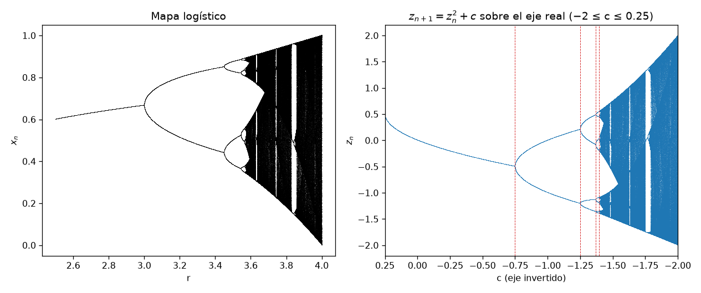

*Figura 8. Izquierda: diagrama del mapa logístico en r. Derecha: misma dinámica en $z_{n+1}=z_n^2+c$ sobre el eje real (c invertido).*

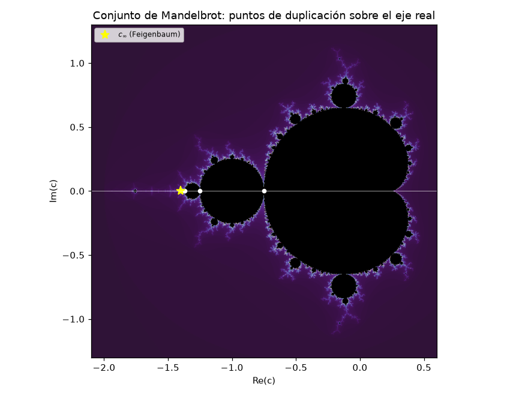

*Figura 9. Puntos blancos: c₁ a c₄. Estrella amarilla: c_∞ ≈ −1.4012.*

**Conclusión.** Los periodos coinciden en ambas iteraciones: 1, 2, 4, 8, 3 y comportamiento aperiódico. El eje real de Mandelbrot **es** el diagrama de bifurcación del mapa logístico visto en otro parámetro. La cardioide principal ↔ punto fijo atractor ($r<3$). El bulbo de periodo 2 (disco de radio ¼ en $c=-1$) ↔ ciclo de periodo 2 ($3<r<3.4495$), y así sucesivamente: cada duplicación es un bulbo cada vez más pequeño sobre el eje real, acumulándose en $c_\infty\approx-1.4012$ (punto de Feigenbaum), donde empieza la antena caótica. Los bulbos mayores dentro de la región caótica, como el de periodo 3 en $c=-1.75$ ($r=1+\sqrt8$), son las ventanas periódicas del diagrama. La transición al caos es, en el plano complejo, la sucesión de bulbos acercándose a la frontera.

---

## Pregunta integradora

**¿Cómo puede una regla determinista, sencilla y completamente conocida producir estructuras de gran complejidad y comportamientos difíciles de predecir?**

La regla es determinista, pero se aplica una y otra vez. La **iteración** convierte una operación simple en un proceso con historia, y la **no linealidad** ($z^2$ o $x(1-x)$) pliega y estira el espacio en vez de sumar efectos linealmente. Esto produce **sensibilidad** a condiciones iniciales y a los parámetros: un cambio diminuto en r o c puede cambiar el destino de la órbita (ej. $c=-0.1+0.65i$, acotada en apariencia durante 74 pasos; o el error amplificado de 10⁻¹⁶ a 10⁻⁵ en 50 iteraciones del reto).

Al variar un parámetro ocurren **bifurcaciones**: el punto fijo pierde estabilidad y nace un ciclo de **periodo** 2, luego 4, 8, 16…, cada vez más próximas entre sí. La cascada se acumula en $r_\infty$ y da paso al **caos**: comportamiento acotado, aperiódico, impredecible a largo plazo aunque cada paso sea calculable — con ventanas periódicas intercaladas (periodo 3, 5, 6…). En el plano complejo la misma organización se ve como una **estructura fractal**: la frontera de Mandelbrot contiene bulbos, espirales y copias aproximadas de sí misma en todas las escalas.

Finalmente, esta cascada no es exclusiva de un mapa: la razón entre bifurcaciones sucesivas tiende a $\delta\approx4.6692$ para toda una clase de sistemas — **universalidad**. La sencillez de la regla no limita la riqueza del comportamiento; la predicción exacta paso a paso convive con la imposibilidad de predecir a largo plazo.

---

## Referencias

1. Devaney, R. L. (2003). *An Introduction to Chaotic Dynamical Systems* (2.ª ed.). Westview Press.
2. Peitgen, H.-O., Jürgens, H., y Saupe, D. (2004). *Chaos and Fractals: New Frontiers of Science* (2.ª ed.). Springer.
3. Strogatz, S. H. (2015). *Nonlinear Dynamics and Chaos* (2.ª ed.). Westview Press.
4. Feigenbaum, M. J. (1978). Quantitative universality for a class of nonlinear transformations. *Journal of Statistical Physics*, 19, 25–52.
5. Lanford, O. E. (1982). A computer-assisted proof of the Feigenbaum conjectures. *Bulletin of the AMS*, 6, 427–434.
